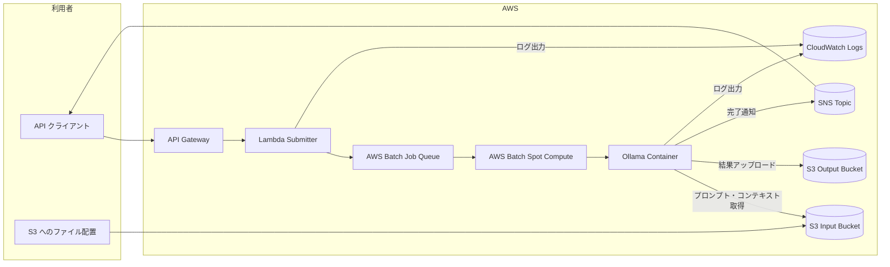

# インフラ構成図

## コンポーネント詳細

- **API Gateway**: `/submit` エンドポイントで JSON リクエストを受け取り、Lambda にプロキシ。
- **Lambda**: リクエストのバリデーション、AWS Batch `SubmitJob` の呼び出しを担当。
- **AWS Batch**: Spot インスタンスを利用するマネージド型 Compute Environment と Job Queue、Job Definition を構成。
- **Ollama コンテナ**: `job/runner.py` をエントリポイントとして実行し、S3 入力を処理、Ollama を実行、S3 出力と SNS 通知を行う。
- **S3 バケット**: `input` と `output` の 2 つを用意。プレフィックス構造を統一し、出力先は入力と同じパスを採用。
- **SNS**: 利用者やオペレーターへの完了通知チャネル。メール、Webhook など必要に応じてサブスクリプションを追加。
- **CloudWatch Logs**: Lambda と Batch ジョブのログを集中管理。トラブルシューティングに利用。

## ネットワーク要件

- Batch の Spot インスタンスがインターネット経由で Ollama モデルや外部依存関係にアクセスできるよう NAT Gateway もしくは Public Subnet を構成してください。
- S3 との通信は VPC エンドポイントを設定することでコストとセキュリティを最適化できます (任意)。

## セキュリティ考慮事項

- IAM ロールは Terraform で最小権限付与 (S3 入出力、SNS Publish、Batch Submit) のみを許可。
- API Gateway に認証を追加する場合は Cognito User Pool や IAM 認証を組み合わせることを推奨。
- S3 バケットにはバージョニングを有効化し、万一の誤削除に備えています。
